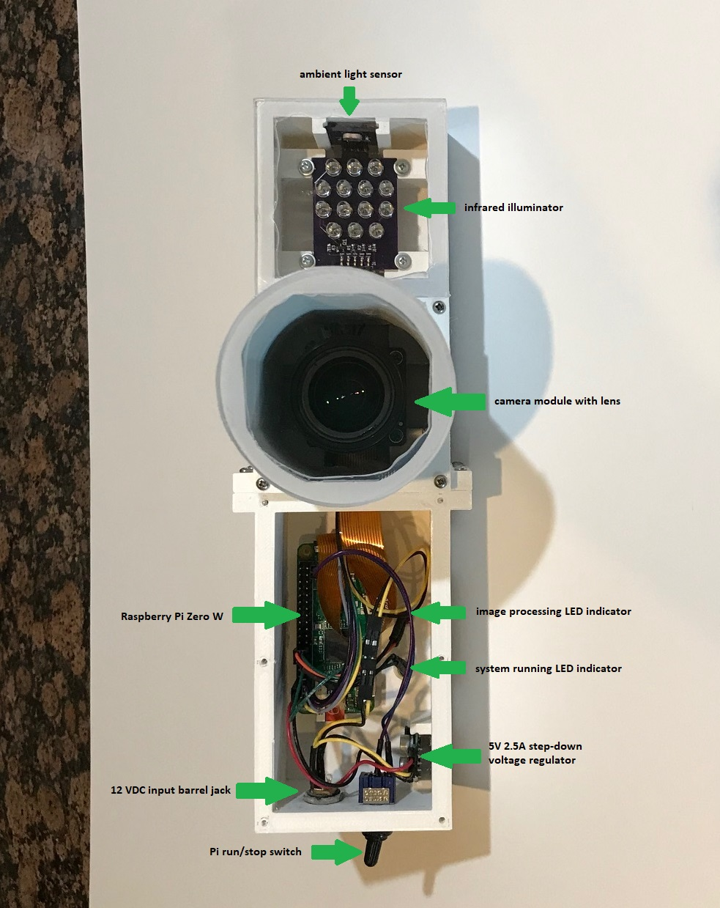
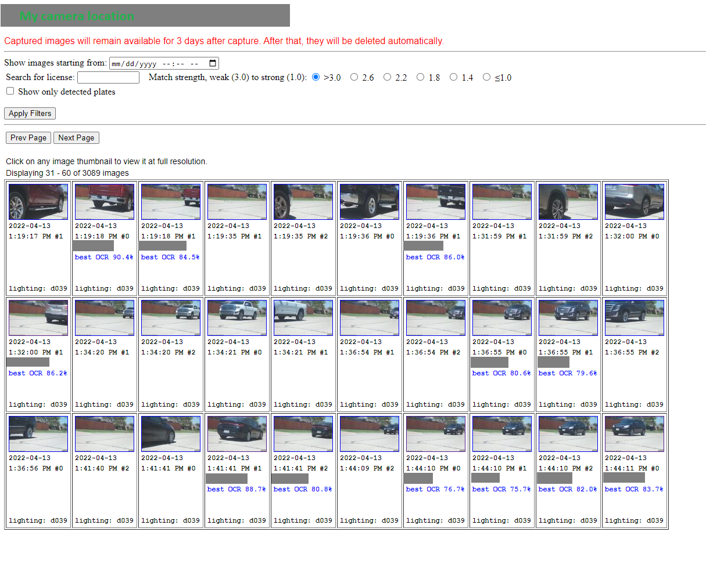

# LPRCam

This project includes the software and hardware design for a DIY motion-activated Raspberry Pi security camera.  The Linux Motion application is used to detect motion and capture images.  The following hardware is used for this project:
* Raspberry Pi Zero W
* Pi Zero W 6" camera ribbon cable (Amazon)
* Raspberry Pi 4 (for web server) -- minimum 2GB RAM; 4GB RAM recommended
* Arducam 12.3 MP HQ camera with automatic IR-cut filter (www.arducam.com) -- photocell removed
* Arducam 12mm CS-Mount Lens with Manual Focus and Adjustable Aperture (Amazon)
* A custom IR illuminator (KiCAD files included)
* A custom ambient light sensor (KiCAD files included)
* A 3D-printable enclosure (STL files included) -- use white PETG filament
* A 5V 2.5A step-down voltage regulator (Pololu #2858)
* 2.1mm DC panel mount barrel jack (Adafruit #610) and plug
* CESFONJER Mini Locking Toggle Switch (Amazon)
* GIVERARE Combination Travel Cable Lock (Amazon)
* DEWENWILS 60W Outdoor Low Voltage Transformer (Amazon)
* Woods 55213143 16/2 Low Voltage Lighting Cable, 100-Feet (Amazon)
* Red and green LEDs with 330 Ohm current limiting resistors
* 26 AWG wiring with various Dupont connectors (KiCAD files included)
* Clear Lexan sheet 0.08x7.6x11 inch or similar dimensions (Amazon)
* Clear silicone waterproof sealant (Amazon)
* Silicone modified conformal coating (Amazon)
* 22 #3-48x1/2" steel screws (Fastenal or McMaster-Carr)
* 12 #3-48x1/16" steel screws  (Fastenal or McMaster-Carr)
* Microchip Pickit 4 programmer (for programming the custom light sensor)
* (Optional) Wireless Access Point (Amazon)

For nighttime operation, when the ambient light sensor registers light below a configured level, software enables the IR illuminator and switches in the IR-cut filter on the camera module.  The light level is used to select one of three different Motion configuration files which have mmalcam_control_params settings appropriate for daytime, twilight, and nighttime operation, respectively.  The light level is a time-averaged reading for which the width of the sampling window may be adjusted via the sensor I2C interface.

The camera box should be printed with white PETG filament to resist outdoor heat.  All parts of the box should be given four coats of silicone modified conformal coating, both inside and out.  (WARNING: silicone modified conformal coating must be applied in an area with good ventilation.)  The Lexan covers for the camera shroud and IR array opening must be cut to fit from the Lexan sheet.  All seams must be filled with silicone sealant to produce a waterproof enclosure, including around the power jack.

# Web Server

The files included in the /web directory provide everything needed to create a web server for reviewing captured images and license plate numbers.  The web server runs on a separate Raspberry Pi 4B.  If the web server is to be accessible from the Internet, it is strongly recommended that the security hardening procedures be followed in setup.txt.

During operation, captured files are periodically copied from the Pi Zero W to the web server via rsync.  A wireless access point may be needed if the camera box is not close to your wireless router.  The web server performs the CPU-intensive analysis of the captured images using OpenALPR to detect and read license plates.  The results are displayed on the web page, an example of which is shown below (for security reasons, plate numbers and actual camera location are blanked out in grey).

For each captured image, a thumbnail is displayed with the date and time of capture and the lighting level at the bottom in format s###, where s is 'd' for day, 't' for twilight, and 'n' for night, and the 3-digit number represents the value read from the light sensor.  If a plate is detected by OpenALPR, the highest confidence plate number result is displayed below the capture date, along with the best confidence level of the optical character recognition (OCR) algorithm (0-100%).  A question mark (?) follows the plate number as a signal that this is the best guess by OpenALPR.  Users may click on any thumbnail to display the full resolution image on a new page.  On this page, the user may enter the actual license plate number so that it may be displayed on the main page in green followed by the text "** verified **".

The top of the main page has a filter section which may be used to limit the number of images displayed.

* Starting date: By default, all captured images are displayed regardless of capture date.  Setting the date and clicking Apply Filters can be used to limit the list to more recent images.
* Search for license: Enter license plate text in this box and click Apply Filters to find OpenALPR results similar to the text supplied.  Use the match strength radio buttons to set how close the match must be to the supplied text.
* Show only detected plates: Check this box and click Apply Filters to display only images for which OpenALPR has found a license plate.

The license plate search algorithm is optimized using OCR statistics gathered from hundreds of prior OpenALPR results that were each manually verified on the view full image page.  Entries made here are added to the OpenALPR .json files in the results directory.  Certain characters like 'B' may be misinterpreted by the OCR engine as '8', or 'D' may be misinterpreted as '4'.  Some characters, like 'I' may not be present at all on any license plate, but might be misidentified from a '1' or from an edge on the license plate.  The genalprstats.py module analyzes the contents of the results directory to determine the frequency at which characters are correctly or incorrectly identified.  The results of this analysis are stored in ocrstats.pickle and applied when the user performs a license plate search using a modified Wagner-Fischer algorithm to find the Levenshtein distance between the plate number entered and the plate numbers returned by OpenALPR.

The Levenshtein distance is defined as the smallest number of 1-character substitutions to convert one string into another.  The modifications to the Wagner-Fischer algorithm allow for the substitution value (normally 1) to be less than one depending on the frequency at which the OCR engine makes an error for the particular substitution. This modified Levenshtein distance can be set as the threshold to count an OpenALPR result as as match when performing a search.  The threshold for the search can be set using the radio buttons at the top of the main web page.  A modified Levenshtein distance of 3.0 or greater signifies a "weak" match, while a modified Levenshtein distance of 1.0 or less represents a "stong" match.

The ocrstats.pickle file in this archive are specific to the location at which testing was originally performed.  This may not be suitable for a different location, in which case a new file might be generated.  However, keep in mind that this requires a large number of plates to be manually verified to generate sufficient data for the analysis.  The existing ocrstats.pickle file was generated from approximately 1,000 analyzed plates, and a similar number is recommended for a new analysis.

