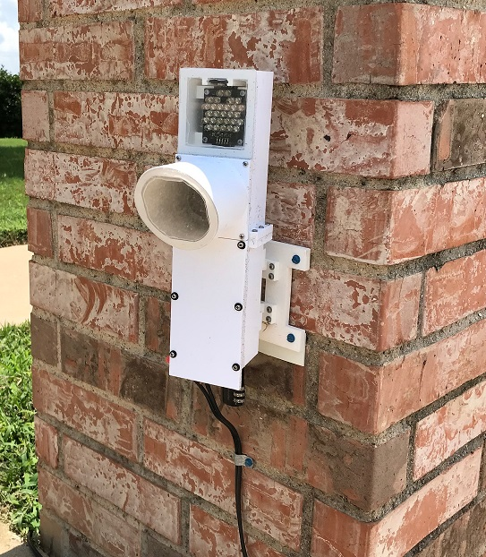

# LPRCam

This project includes the software and hardware design for a DIY motion-activated Raspberry Pi security camera.  The Linux Motion application is used to detect motion and capture images.  The following hardware is used for this project:
* Raspberry Pi Zero W
* Arducam 12 MP HQ camera with switchable IR filter
* Arducam 12mm lens
* A custom IR illuminator (KiCAD files included)
* A custom ambient light sensor (KiCAD files included)
* A 3D-printable enclosure (STL files included)
